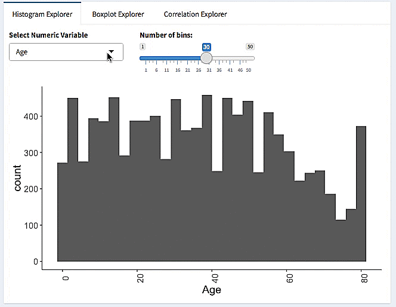

```{r setup, include=FALSE}
knitr::opts_chunk$set(echo = FALSE, message=FALSE)
```

## Our Overall Goal  

- Look at NHANES data
- Understand how the variables are defined
- Understand associations between outcome and variable
- Understand interactions between variables
- Share insights about the data with each other


## What is NHANES and why are we looking at it?

- **N**ational **H**ealth **A**nd **N**utrition **E**xamination **S**urvey
- Assess health/nutritional status of adults/children in the United States
- Types of Survey Questions:
    + Demographic (Age, Race, Gender, many more...)
    + Socioeconomic (Marriage Status, Household Income, Education)
    + Dietary (Foods consumed, dietary supplements)
    + Health (Body Mass Index, Sleep Trouble, Depression)

## Please Note

- We're not going to look at all of NHANES.
- We're looking at an extract from two years of the survey (which years?)
- We're ignoring how particpants were chosen/sampled from the larger population
    + We'll talk a a little about this later.

## NHANES is a valuable dataset in many ways

```{r echo=FALSE}
library(dplyr)
library(here)
covariates <- c("Gender", "Age", "SurveyYr", "Race1", "Race3" ,"MaritalStatus", 
                "BMI", "HHIncome", "Education",
                "BMI_WHO", "BPSysAve", "TotChol", "Depressed", "LittleInterest", 
                "SleepHrsNight", "SleepTrouble", "TVHrsDay", "AlcoholDay", 
                "Marijuana", "RegularMarij", "HardDrugs")

data_dictionary <- readr::read_csv(here("../nhanes_explore/data/data_dictionary.csv")) %>%
  filter(VariableName %in% covariates) %>% arrange(as.character(VariableName))

knitr::kable(data_dictionary)
```

## Outcomes

We can understand an outcome and look at its association with measured variables in the data.

We'll look at Depression today, but there is also Physical Activity and Diabetes Status as well

## Before we Start

- Pair off or get into groups of 3.

- Given the list of variables, come up with one question about your outcome you're curious about. 

- What do you expect is the case?

- See if you can answer it!

## Take a Look at the Data as a Sheet

[NHANES Extract in Google Sheet Form](https://docs.google.com/spreadsheets/d/1cSZCyjqbBh1RWeP3fV3zRQxTN4vWw63IKwGKVG_Tp74/edit?usp=sharing)


## What is Exploratory Data Analysis?

- Pioneered by John Tukey
- Detective work on your data
- An *attitude* towards data, not just techniques
- 'Find patterns, reveal structure, and make tenative model assessments (Behrens)'

## Remember

"Exploratory data analysis can never be the whole story, but nothing else can serve as the foundation stone."
- John Tukey, *Exploratory Data Analysis*

## EDA is about Visualization First

- Visualization is a gateway
- Understand the issues, not focus on coding right now
- Build your foundation

## Running the Explorer App

We'll start exploring the data immediately!  

Go to the app:

+ https://tladeras.shinyapps.io/nhanes_explore/

## Map your questions to a tab:

- Overview
- Categorical Variable
- Continuous Variables

## What is the Overview Tab for?

- Seeing how many variables are in the dataset and which type
- Seeing missing values and complete cases
- Looking up a variable in the data dictionary


## Overview Tab

  - What values are missing from the dataset overall? (Visual Summary)
  - Are any numeric values skewed in distribution? (Tabular Summary)
  - How is the variable defined? (Data Dictionary)
  - What are the permissible values? (Data Dictionary)

## Let's try it!

1.  How many categories are there for the `Depressed` variable? (in R, we call them factors)
1.  How many missing cases are there for `Depressed`?
1.  What is the mean age for the dataset?
1.  How is the `Depressed` variable defined in this dataset?

## What is the Category Tab for?

- Should we add a categorical variable to our model?
- Does my categorical variable have predictive value?
- Does adding my variable affect the number of cases I can analyse?
- Is my variable missing at random or not at random?
- Is my categorical variable confounded with another categorical variable?

## Categorical Tab

  - What percentages exist for my categorical variable? (Single Category)
  - Is my variable associated with outcome? (Category/Outcome)
  - Is my variable associated with other variables? (Crosstab)
  - Are the missing values of my variable evenly distributed? (Missing Data)

## Categorical Example

Do people with the `most` days of `LittleInterest` also have the `most` days of Depression?


## Categories: Let's try it!

1. What is the category with the largest counts for `Depressed`? 
1. Do the proportions of people with your outcome look the same for those who use marijuana versus those who don't use it?

## Why is the Data Missing?

Many reasons for the data being missing from a variable!

- Data was not collected
  - People were excluded (why?)
- Combinations of variables don't make sense (structural zeros)
  - Cis-males and pregnant status

## Things to Consider about Missing Data

- How was the Data Collected?
- Is there a discernable pattern to the values that are present vs. those that are missing?
- Is there an underlying explanation for the missing values?

[NA: When Missing Data is Valuable](https://www.slideshare.net/CaitlinGarrett1/null-when-missing-data-is-valuable)

## Assessing Missing Data: NaNiar


## Continuous Tab

- What is the distribution of my categorical variable? (Single Continuous)
- Is my continuous variable associated with outcome? (Continuous/Outcome)
- Is my continuous variable associated with another categorical variable? (Boxplot)
- Is my continous variable associated with another continous variable? (Correlation)
- Is my continuous variable missing values? (Correlation)

## Continuous Scatter

If you get less hours of sleep per night, does that mean you have a higher BMI?


## Continuous Boxplot

If you have a lot of depressed episodes, do you also get less sleep?



## Continuous: Let's Try it!

- Is there something strange about `Age` in the dataset? 
- As you get older, does your `BMI` go up?
- Do `Depressed` people have a higher systolic blood pressure than non depressed people?


## Depression Questions

1. Is there an association of `LittleInterest` with `Depressed`?
1. Is marijuana use associated with depression?
1. Is Hard Drug use associated with depression?
1. How are sleep and marijuana use related in the dataset?
1. Is there a relationship between Sleep hours and depression?
1. Is there a relationship between Sleep hours and Age?
1. Is there a relationship between hours TV watched and Depression?
1. Or, choose a question! It should look at least two variables.


## Let's learn from each other

Each group should present the findings from 1 interesting question:

1. Where did you find it in the app? 
2. What variables did you look at? How were they defined?
3. What did you expect in terms of the relationship?
4. For another variable, assess the association of your non-`Depressed` variable with it.
5. What did you find?

## Some Final Notes about NHANES

- NHANES was designed with a very special sampling design, that was meant to be representative to the United States
- There are weights that you must utilize for real modeling and analysis

## Congratulations

You are now a full fledged data explorer!


https://waynepelletier.com/work/tasty-icons

## Burro

R package that lets you explore your data:

http://laderast.github.io/burro

