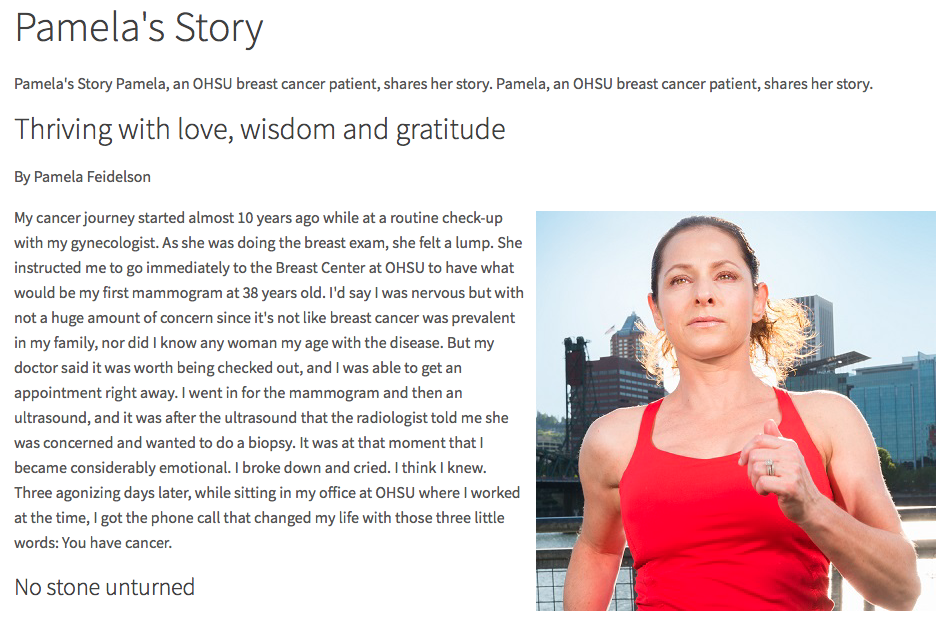
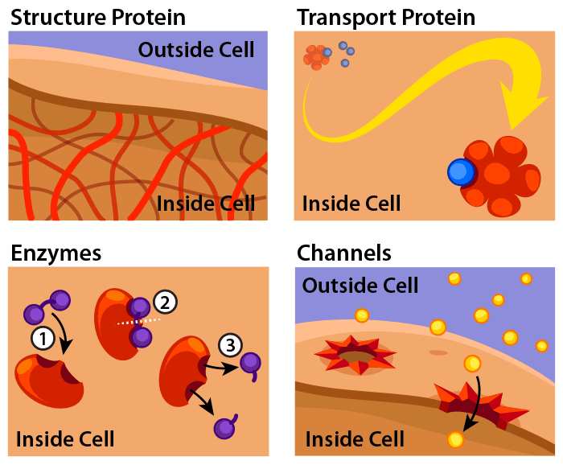
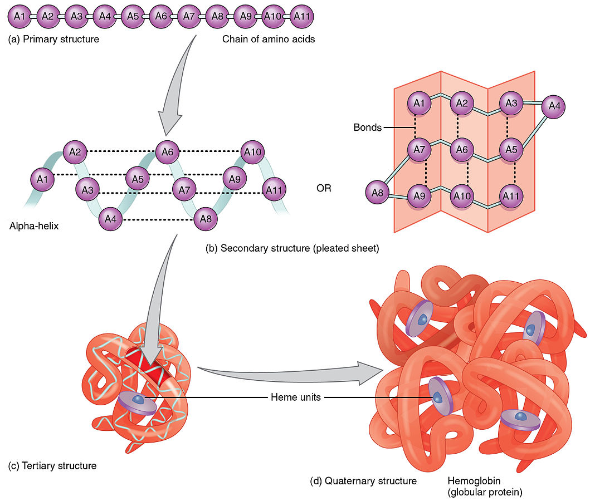
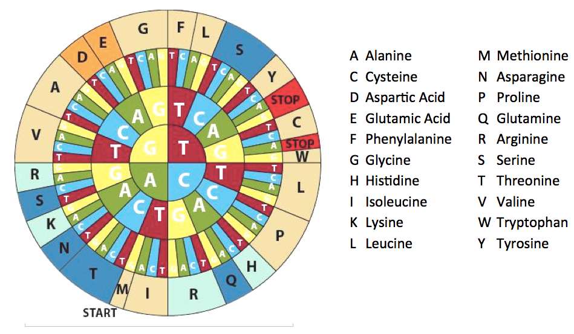
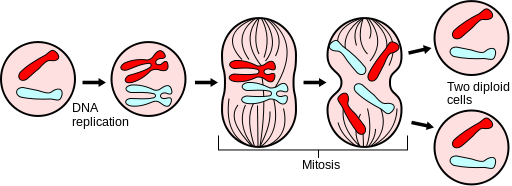
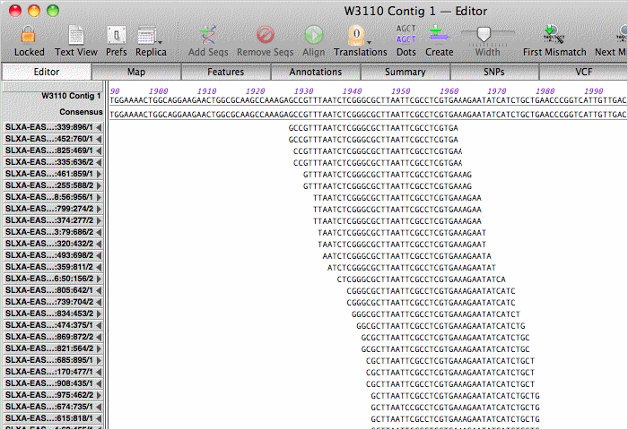
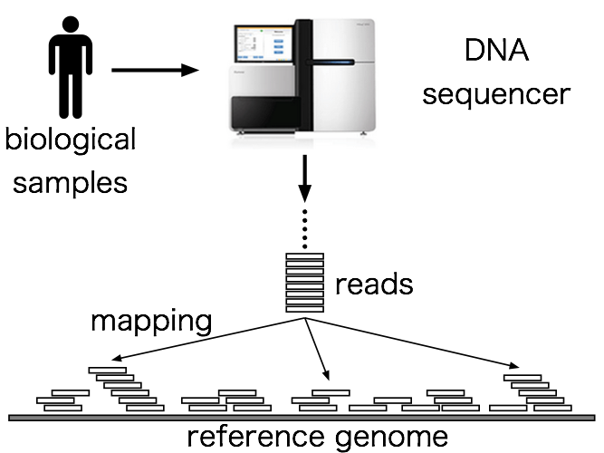
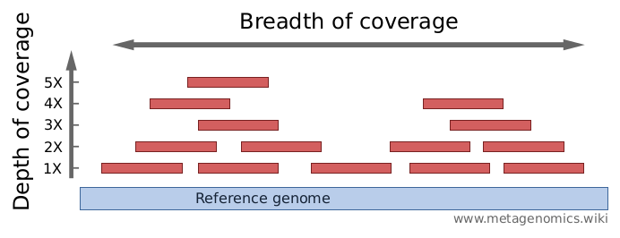
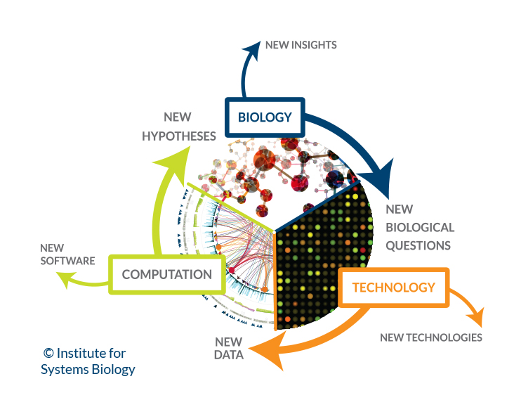
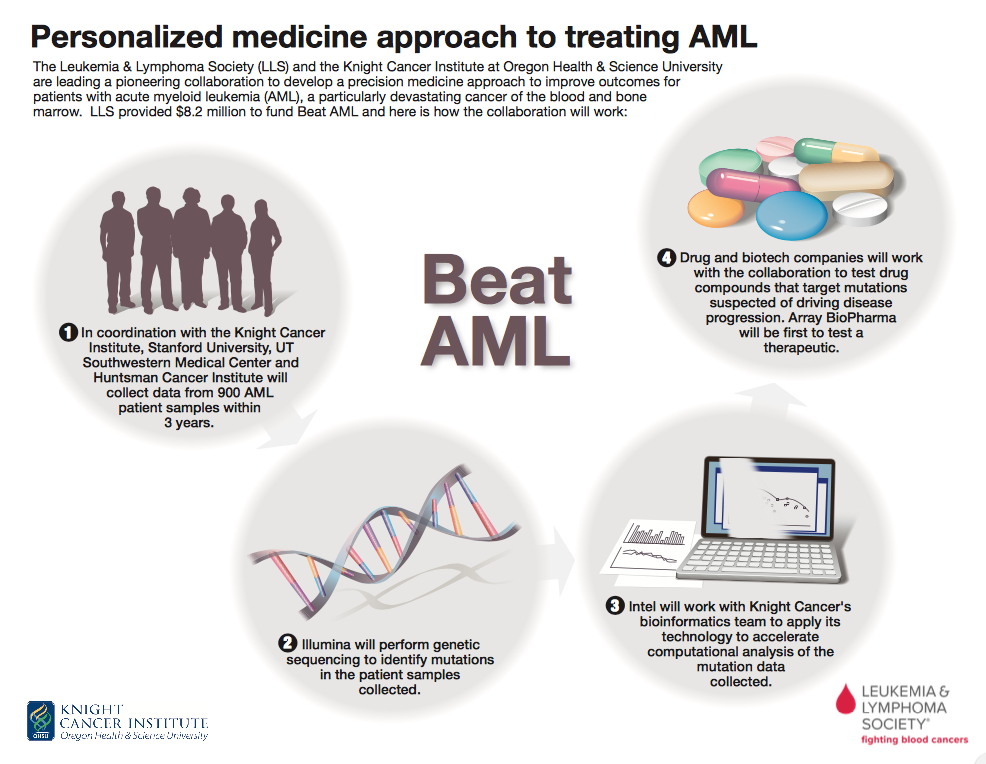

```{r setup, include=FALSE}
knitr::opts_chunk$set(echo = TRUE)
```


# Reading Assignments

1. Why do genomics? https://discoveringthegenome.org/discovering-genome/what-genomics-why-do-genomics/health

1. What are proteins and what do they do? https://ghr.nlm.nih.gov/primer/howgeneswork/protein

1. How do genes direct the production of proteins? https://ghr.nlm.nih.gov/primer/howgeneswork/makingprotein

1. Interactive Presentation about Central Dogma and Genetic Medicine: http://www.hhmi.org/biointeractive/central-dogma-and-genetic-medicine

1. Intro to sequencing: https://discoveringthegenome.org/discovering-genome/dna-sequencing/sequencing-synthesis


---
# Genomics

What is genomics?

As opposed to *genetics*, which is more concerned with single genes, the term *genomics* covers the entire genome

---

# Last Time

- We talked about finding association of disease with SNPs 
- This time, we're actually looking at understanding the effect and mechanism of mutations

---

# What is the difference...

What is the difference between a mutation and a variant?

--

Has to do with frequency - mutations are much more rare than variants

--

---
# Our Motivation

```{r fig.align='center', out.width="600px", echo=FALSE}

```

.footnote[https://www.ohsu.edu/xd/health/services/cancer/patient-stories/pamelas-story.cfm]

---

# Learning Objectives

1. What are proteins and how are they made in the body?
1. What is a mutation? How can mutations disrupt protein functions?
1. What is a reference sequence and why is it important in sequencing?
1. What is Next Generation Sequencing and how do we use it to detect mutations?
1. Activity: Looking at a mutation in cancer
1. Biology of Cancer

---

# Proteins are the machinery of the cell

.pull-left[- Proteins serve [lots of different functions](https://ghr.nlm.nih.gov/primer/howgeneswork/protein) in the cell
    - Structure
    - Antibody (allergies)
    - Messenger (hormones)
    - Enzyme (assist with reactions)
    - Transport/Storage
    ]
.pull-right[
```{r fig.align='center', out.width="500px", echo=FALSE}

```
]
    
.footnote[https://askabiologist.asu.edu/venom/what-are-proteins]

---

# How are proteins constructed?

- Sequences of [20 different amino acids](https://en.wikipedia.org/wiki/Amino_acid) make up parts of the protein
- amino acid chains "fold" to make up parts
- sequence of amino acids determines the structure

```{r fig.align='center', out.width="500px", echo=FALSE}

```

.footnote[By OpenStax College - Anatomy &amp; Physiology, Connexions Web site. <a rel="nofollow" class="external free" href="http://cnx.org/content/col11496/1.6/">http://cnx.org/content/col11496/1.6/</a>, Jun 19, 2013., <a href="https://creativecommons.org/licenses/by/3.0" title="Creative Commons Attribution 3.0">CC BY 3.0</a>, <a href="https://commons.wikimedia.org/w/index.php?curid=30131163">Link</a>]
---

# Proteins gone bad

- Specifying the wrong amino acid in a sequence can lead to changes in the protein structure
- Changes in protein structure can disrupt the function of proteins
- Can change phenotype!

We're going to be looking at BRAF, which is a protein that is altered in cancer.

---

# How do we get from gene to protein?

Central Dogma:

```{r fig.align='center', out.width="300px", echo=FALSE}
knitr::include_graphics("image/central_dogma.jpg")
```

.footnote[https://en.wikipedia.org/wiki/Central_dogma_of_molecular_biology]

---

# For right now, just think

Gene -> Complementary Strand -> Protein

---
# 3 bases = 1 codon

Codons: 3 nucleotide bases in the DNA = 1 amino acid in protein

Example: GCT = Alanine

What AA is coded by CAC?

```{r fig.align='center', out.height="500px", echo=FALSE}

```

.footnote[https://www.yourgenome.org/activities/kras-cancer-mutation]
---

# Our cells replicate 

- During cell division (mitosis), chromosomes line up to be replicated in each cell  
- Special enzymes (polymerases) produce copies of the cell DNA  
- Each step has an opportunity to go wrong and introduce mistakes in the replication

```{r fig.align='center', out.width="500px", echo=FALSE}

```

.footnote[https://commons.wikimedia.org/wiki/File:Major_events_in_mitosis.svg]
---
# Mistakes Happen

- Mistakes may happen in replication 
- Introduce mutations in the sequence of replicated cells
- Enzymes can correct some mistakes, but not all

---
# Mutations can alter protein function

- Mutations can change amino acid specified
- Genetic mutations can alter which amino acid is used in a protein sequence
- Alterations in Amino Acids 

---
# Not all Mutations are the same!

What do you notice about the coding wheel?

```{r fig.align='center', out.width="500px", echo=FALSE}

```

- *synonymous mutations* (no change in AA)
- *non-synonymous mutations* (cause change in AA)

.footnote[https://www.yourgenome.org/activities/kras-cancer-mutation]

---

# Reference Genomes are Important

We need [reference genomes](https://en.wikipedia.org/wiki/Reference_genome), which are derived from only a few individuals.

We need these to *align* our own sequencing samples to locations in the genome

This works because human genomes are 99.9% similar to each other.

---

# Lots of little pieces

- Extract DNA from tissue sample
- [Fragment DNA](https://bitesizebio.com/36824/best-practices-dna-shearing-ngs/) into tiny pieces
- Sequence these tiny pieces all at once!
- *Sequence Read*: one of these tiny pieces

```{r fig.align='center', out.height="400px", echo=FALSE}

```

.footnote[http://macvector.com/Assembler/bowtiengsassembly.html]
---
# Aligners 

[Heavy duty programs](https://bitesizebio.com/36858/next-gen-sequencing-challenges/) that take all the sequence pieces and align them to genome

- Aligning one read may take time 
    - need to search over 3 Billion places in the genome
- Aligners try to align many reads at once
- Still takes a long time!
- Using them requires understanding sequencing technology

```{r fig.align='center', out.width="400px", echo=FALSE}

```
.footnote[https://julialang.org/blog/2015/10/biojulia-sequence-analysis]

---
# What evidence is there?

Our results can be summarized with two terms:

- [*Coverage*](https://bitesizebio.com/34461/ngs-depth-coverage-deep-sequencing/) - How much of the genome do our reads align to?
- [*Depth*](https://bitesizebio.com/34461/ngs-depth-coverage-deep-sequencing/) - How many reads are there for a particular position at the genome

```{r fig.align='center', out.height="400px", echo=FALSE}

```

.footnote[http://www.metagenomics.wiki/pdf/definition/coverage-read-depth]
---

# Errors in sequencing 

- Sequence calling process has errors
- Can impact alignment and evidence 
    - Good aligners incorporate thinking about types of errors
- Solution: incorporate *quality* scores for each position
- Look for errors in the sequence data

---
# Matched Normal/Tumor samples

In cancer, we try to compare *tumor* tissue with *normal* tissue when we sequence. Why?

--

We do this to separate genomic alterations into two types:

- *germline* - alterations that are inherited by birth
- *somatic* - alterations that are acquired after birth

---
# In-class assignment: Genomics

Today we're going to look at a particular oncogene that is implicated in cancer: BRAF

Download the Codon Wheel and the Sample Sheet in `2.2/in-class-activity/` in D2L

Put your results here: https://docs.google.com/spreadsheets/d/1QqQ4x2kBlkxA8kt9ookbXVq6otoeuqNM6CaQse22Wj8/edit?usp=sharing

.footnote[https://www.yourgenome.org/sites/default/files/downloads/activities/braf-from-gene-to-cancer-therapy/]

---
# Translating

1. Find the consensus sequence first
1. Translate that into the complementary strand 
    1. Remember, A pairs with T and C pairs with G
1. Working backwards, translate the complementary sequence into Amino Acids

```
consensus sequence
ATT TCT TAC
TAA AGA ATG
complementary sequence
I   R   V    <----
amino acid sequence (work backwards)
```

---
# Some things to think about

What does an error look like, and what does a mutation look like?

When you translate to amino acids, read in the 5' to the 3' direction

---

# Discussion: What are your findings?

---

# Point mutations are only one kind

- Lots of other genomic alterations are associated with cancer
- Genomic Rearrangement
- Immune system
- Epigenome

---

# "omics"

- quantitative measurements on cells and people
    - multiple things are measured at once ("high-throughput")
      - proteomics - measure levels of proteins
      - transcriptomics - measure levels of RNA
      - metabolomics - measure abundance of bacteria
      - immunomics - measure immune system cells

---

# Need the bigger picture!

- Systems Biology of Cancer
- Understand how cell function is dysregulated
- Requires integrating across omics measurements
- Requires previous knowledge of low-throughput biology
  
```{r fig.align='center', out.width="500px", echo=FALSE}

```

.footnote[https://www.systemsbiology.org/about/what-is-systems-biology/]

---

# BeatAML

```{r fig.align='center', out.width="600px", echo=FALSE}

```

.footnote[http://www.ohsu.edu/xd/health/services/cancer/about-us/druker/beat-acute-myeloid-leukemia.cfm]
