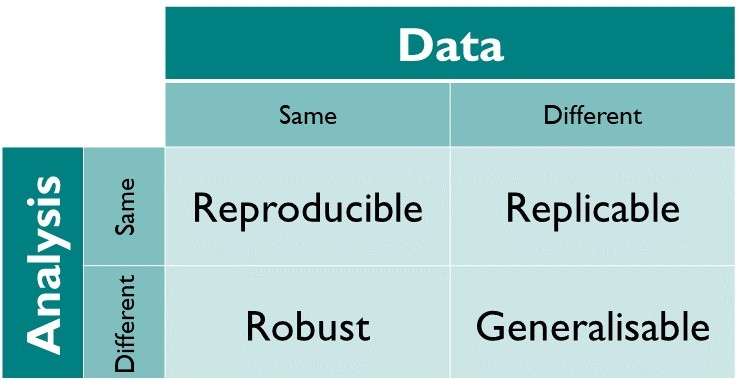
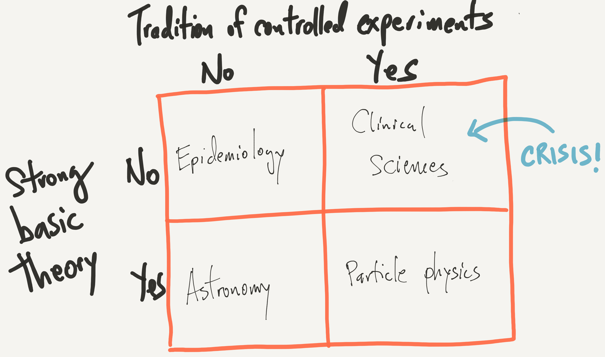
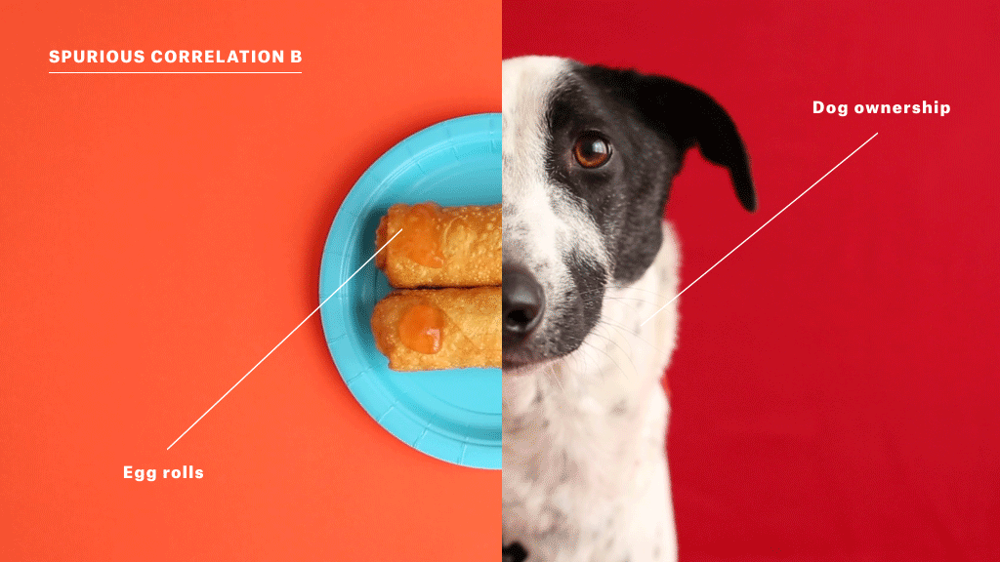
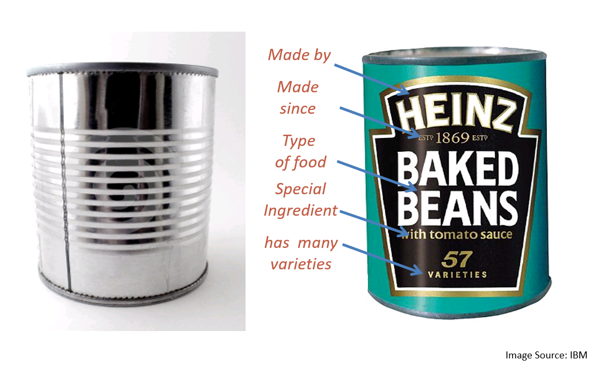
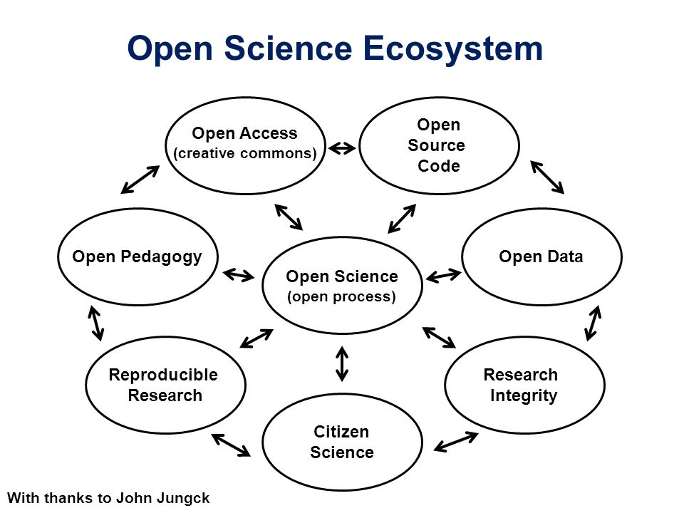
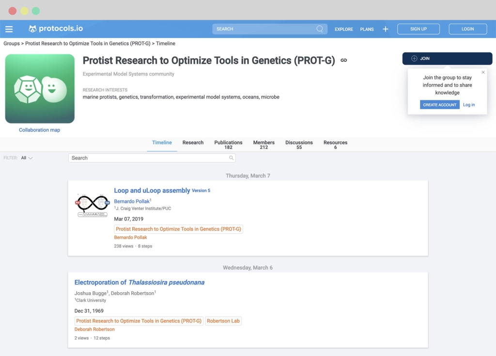

```{r setup, include=FALSE}
options(htmltools.dir.version = FALSE)
knitr::opts_chunk$set(eval=TRUE)
```
# Learning Objectives

- Explain why the replicability crisis is important
- Describe what metadata is and why it matters to the replicability crisis
- Name 3 types of experimental metadata
- Describe what open science efforts there are out there
- Identify Barriers that prevent open science adoption

---
# What is Replicability?


---
# Reproducibility versus Replicability

- Reproducibility: Same Analysis, Same Data
- Replicability: Same Analysis, Different Data

.footnote[https://the-turing-way.netlify.com/reproducibility/03/definitions]
---
# What is the Replication Crisis?

- Some key scientific findings cannot be replicated by other labs
- Survey of 1500 scientists: 
  - 70% surveyed couldn't replicate a colleagues study
  - 50% couldn't replicate their own study
- Reproducibility project: findings for only 39 out of 100 psychological studies could be replicated

.footnote[https://www.apa.org/monitor/2015/10/share-reproducibility]
---
# Example: Marshmallow Test


.footnote[https://www.sciencenews.org/article/kids-waiting-longer-classic-marshmallow-self-control-test]
---
# Marshmallow Test Study Findings

- One marshmallow now, but two marshmallows if you wait
- Walter Mischel: [Self Control/delayed gratification](https://www.webcitation.org/62C0yfhcJ?url=http://duende.uoregon.edu./~hsu/blogfiles/Shoda%2CMischel%2C%26Peake%281990%29.pdf) leads to better outcomes in life
  - Followed up with participants 18 years later
  - Found increased "cognitive and academic competence" among the two marshmallow kids 

---
# Replicating the Marshmallow Test

- Study has been difficult to replicate
  - Is it really just measuring socioeconomic status?
  - Well-off children tend to get better education
- "[Conceptual Replication Study](http://journals.sagepub.com/doi/10.1177/0956797618761661)": self-control is not associated with better outcomes

.footnote[[A new approach to the marshmallow test Leads to complicated findings](https://www.psychologicalscience.org/publications/observer/obsonline/a-new-approach-to-the-marshmallow-test-yields-complex-findings.html)]
---
# Why do we have the replication crisis?

Cultural:

- Pressure to publish in prestigious journals such as Nature
- Requires 'impactful' results to get published
  - Bias against negative results

Statistical: 

- [Ioaniddis](https://www.google.com/url?q=https://doi.org/10.1371/journal.pmed.0040215&sa=D&ust=1509336365149000&usg=AFQjCNHL97YgMrU1ukdTFcyylW4gn5TmQA): Studies rely on questionable research practices
  - Sample Sizes are too small to justify conclusion
  - p-hacking: running too many statistical tests and only reporting the good ones

Experimental:

- **Not enough detail to rerun the experiment and analysis**

---
# Roger Peng on the Replicability Crisis

> The replication crisis in science is concentrated in areas where (1) there is a tradition of controlled experimentation and (2) there is relatively little basic theory underpinning the field.



https://simplystatistics.org/2016/08/24/replication-crisis/

---
# Spurious Correlations and False Findings




.footnote[[You can't trust what you read about nutrition](https://fivethirtyeight.com/features/you-cant-trust-what-you-read-about-nutrition/)]

---
# What are some solutions to the crisis?

- Better statistical practices
  - Pre-registration of analyses
  - Larger sample sizes
  - More stringent cutoffs for statistics
- Better education about reproducibility practices
  - [The Turing Way](https://the-turing-way.netlify.com/)
- **Metadata and Open Science Practices**
  - Provide enough details about the experiment
  - More transparency about how experiment was conducted

.footnote[[Scientific method: Statistical errors](https://www.nature.com/news/scientific-method-statistical-errors-1.14700)]
---
# What is Metadata?

- "Data about data"
- “Metadata is structured information that describes, explains, locates, or otherwise makes it easier to retrieve, use, or manage an information resource” (NISO)
- **Working definition: Information that lets us utilize a dataset effectively**

---
# Metadata Example

Without the label metadata, we don't know what's in the can!


---
# What Kinds of Experimental Metadata Are there?

- Date experiment was done
- Time a measurement was made
- Number of repeated measurements
- Who conducted the experiment
- Dosage of treatment
- How many subjects were in study
- How many subjects dropped out of study
- Experimental design

---
# Metadata and studies (Activity)

We want to know if we can combine data from two different sites that conducted the same experiment. The two sites are: 1) a local university and 2) a nursing home.

The study consists of testing whether a weight-loss drug works compared to a placebo on patients from both sites.

What metadata would you want to know about these two experiments? Think about the details you'd want at the experiment level, not the patient level.

One example: What was the dosage of drug given to the patients at the two sites? Was it the same?
---
# Minimum Information Standards for Experiments

- [Provide enough metadata](https://fairsharing.org/collection/MIBBI) for others to replicate your experiment
- Software used, experimental design, dates samples run
- Designed by consortia of experts
- Example: [MIGen: Minimum Information about a Genotyping Experiment](http://migen.sourceforge.net/MIGenDownloads/MIGen_V09_Application_Example_Oct.2010.pdf)

---
# What drives minimum information standards?

- Public Databases/Repositories of data
  - Some require these minimum information standards
- Government Mandate (NIH agencies)
  - Data must be submitted to public repositories
- **Open Science and Need for transparency**

---
# What is Open Science?

- Openly sharing your research
  - Open Publications 
  - Open Experimental protocols 
  - Open Software  
  - Open Data
- Community of Practices surrounding each of these

---
```{r eval=TRUE, echo=FALSE, fig.retina=1.2}

```

.footnote[https://slideplayer.com/slide/7960613/25/images/3/Open+Science+Ecosystem.jpg]
---
# Benefits to Open Science

- Transparency
- Accessibility
- Efficiency
- Many minds on the same dataset
- Community of Practice

.footnote[https://www.fosteropenscience.eu/content/what-are-benefits-open-science]
---
# Open Access Publications

- Preprint Servers (bioArxiv)
  - The cutting edge of Science
- Open Access Publications
  - Public Library of Science (PLOS)

---
# Open protocols: Protocols.io

```{r eval=TRUE, echo=FALSE, fig.retina=1.2}
  
```

---
# Open Data Repositories

- [Data should be FAIR](https://www.force11.org/group/fairgroup/fairprinciples): (Findable, Accessible, Interoperable, and Re-usable)
- [Recommended Data Repositories](https://www.nature.com/sdata/policies/repositories)
- Repositories make data available for everyone to download
  - Animal studies/Cell Line studies are easy to share
  - Patient Datasets are difficult (HIPAA)

---
# Open Software: rOpenSci

- Community that develops software for scientific research
- Review process, community discussion

---
# Replication is still difficult and expensive

- [A long journey to reproducible results](https://www.nature.com/news/a-long-journey-to-reproducible-results-1.22478)
- [The Economics of Reproducibility in Preclinical Research](https://journals.plos.org/plosbiology/article?id=10.1371/journal.pbio.1002165)

---
# Barriers to Open Science

- Researchers "don't have enough time"
- Open Studies expose researchers to more detailed scrutiny
- Perception of "Research Parasites"
  - Secondary Use of data
  - Studies cost money, sharing can be detrimental to career
- Open Contributions are not recognized
  - Promotion and Tenure guidelines
- Funding incentives
  - "Not in my job description"
- Culture of shame/impostor syndrome  

---
# Research Parasites

Cons of secondary use:

- Generating Data costs Grant Money/Time
- Secondary use of data is not beneficial to generators of data

Pros:
- "The act of rigorous secondary data analysis is critical for maintaining the accuracy and efficiency of scientific discovery." (Greene et al)
- New discoveries from other people reusing data for analysis

.footnote[[Celebrating Parasites](https://www.ncbi.nlm.nih.gov/pmc/articles/PMC5710834/)]  
---
# Leslie Chan: Openness can be exploited

> But if data is indeed the new oil, who owns the oil, and how should it be governed, and for whose benefit? What about issues of privacy, security, consent, misuse, and other important ethical issues and historical injustice? - [Leslie Chan](https://www.openlibhums.org/news/314/)

- Openness is the new frontier
  - Exploitation/Manifest Destiny
- Open Access requires money 
  - Diversity/Inclusion: Volunteer work penalizes those who need to work
  - Research institutions that have money are overrepresented
- Companies may exploit openness and communities
  - [DataCamp Debacle](https://www.buzzfeednews.com/article/daveyalba/datacamp-sexual-harassment-metoo-tech-startup)

---
# Take Home Points

- Replication by another lab requires metadata
- Metadata standards are driven by public databases
- Open Science encourages transparency in process
- Barriers to Open Science are cultural and technical